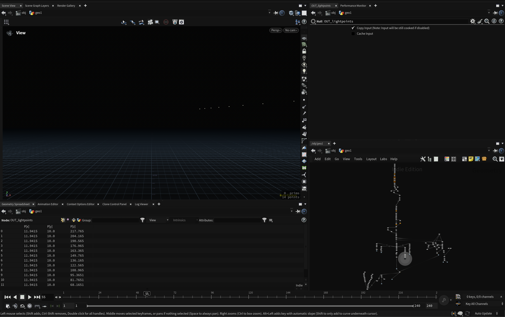

# EditorialDark

A clean, high-contrast dark color scheme for Houdini UI and node graph work.

## What It Does

This repo provides a custom Houdini dark theme with tuned colors for readability and focus.

- `EditorialDark.hcs`: Main Houdini UI color scheme.
- `NodeGraphDark.inc`: Node graph color overrides included by the main scheme.
- `preview.png`: Visual preview of the theme.

## Setup

1. Find your Houdini preferences folder for your installed version.
2. Copy `EditorialDark.hcs` and `NodeGraphDark.inc` into the `config` folder.
3. Launch Houdini, open Color Settings (UI color scheme), select `EditorialDark`, then apply.
4. Restart Houdini if the theme does not update immediately.

Typical `config` paths:

- macOS: `~/Library/Preferences/houdini/<version>/config/`
- Windows: `%USERPROFILE%\Documents\houdini<version>\config\`
- Linux: `~/houdini<version>/config/`

## Notes

- This theme is intended as a practical cross-platform setup (paths can vary slightly by Houdini version).
- To revert, remove the copied files from your Houdini `config` folder and switch back to the default scheme.
